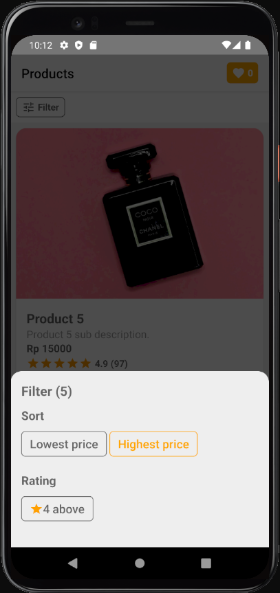
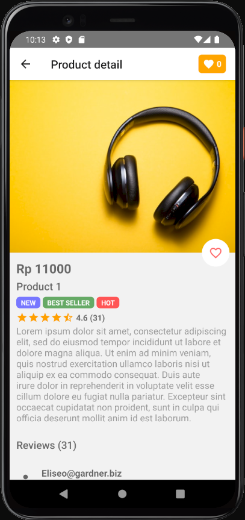
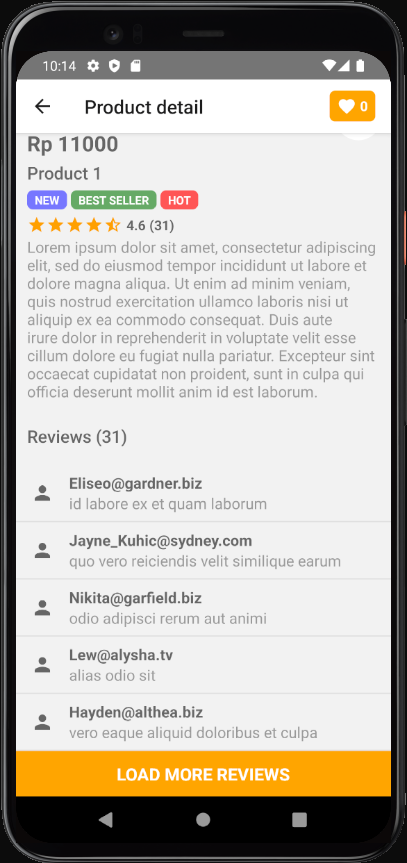
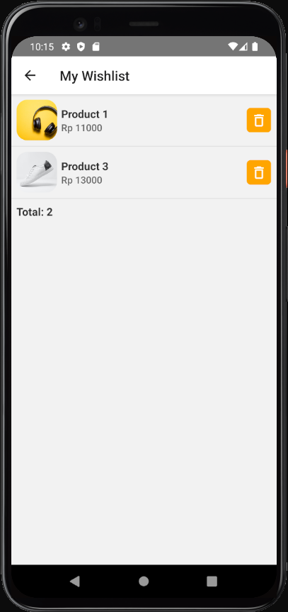

# Simple Project

This is a simple app built with React Native. Tested on **Windows/Android**.

### Run/debug in local

1. Prepare your testing device/emulator.

2. In the project's root folder, execute these commands:
   ```
   npm install
   npm run android
   ```

### Bundle app for production

Ref: https://reactnative.dev/docs/signed-apk-android

1. In your JDK's bin folder (usually `C:\Program Files\Java\jdkx.x.x_x\bin`), execute this command:
   ```
   keytool -genkeypair -v -storetype PKCS12 -keystore my-upload-key.keystore -alias my-key-alias -keyalg RSA -keysize 2048 -validity 10000
   ```

   This command prompts you for password and other information for your key, then generates the keystore as a file called `my-upload-key.keystore`. For this example, we can set `password` as the password.

2. Place the `my-upload-key.keystore` file under the `android/app` directory in your project folder.

3. Edit the file `android/gradle.properties`, and add the following:
   ```
   MYAPP_UPLOAD_STORE_FILE=my-upload-key.keystore
   MYAPP_UPLOAD_KEY_ALIAS=my-key-alias
   MYAPP_UPLOAD_STORE_PASSWORD=password
   MYAPP_UPLOAD_KEY_PASSWORD=password
   ```

4. Add signing config in your app's Gradle config (`android/app/build.gradle`):
   ```
   ...
   android {
     ...
     defaultConfig { ... }
     signingConfigs {
       release {
         if (project.hasProperty('MYAPP_UPLOAD_STORE_FILE')) {
           storeFile file(MYAPP_UPLOAD_STORE_FILE)
           storePassword MYAPP_UPLOAD_STORE_PASSWORD
           keyAlias MYAPP_UPLOAD_KEY_ALIAS
           keyPassword MYAPP_UPLOAD_KEY_PASSWORD
         }
       }
     }
     buildTypes {
       release {
         ...
         signingConfig signingConfigs.release
       }
     }
   }
   ...
   ```

5. Back to our project's root folder, execute these commands:
   ```
   cd android
   ./gradlew bundleRelease
   ```

   It will generate AAB file (Android App Bundle) that can be found under `android/app/build/outputs/bundle/release/app-release.aab`.

6. To test the release build of your app, execute this command in the project root:
   ```
   npx react-native run-android --mode=release
   ```

### App screenshots

**Home screen**




**Detail screen**




**Wishlist screen**


